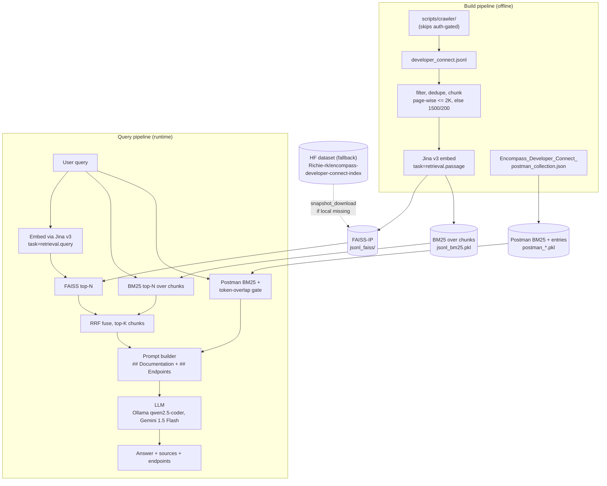

<div align="center">

# Encompass RAG Assistant

A Retrieval-Augmented Generation (RAG) system for querying Encompass API documentation in plain English, with hybrid retrieval and support for more than one LLM.

[](https://opensource.org/licenses/MIT) [](https://huggingface.co/datasets/Richie-rk/encompass-developer-connect-index)

</div>

> **Unofficial.** Not affiliated with ICE Mortgage Technology. This is a community-built retrieval index and RAG pipeline over the publicly available Encompass Developer Connect documentation, meant as a developer reference and for educational and research use. For canonical, up-to-date documentation, always defer to the official source: <https://developer.icemortgagetechnology.com/>.

## Why I built this

I worked for a mortgage client whose loan origination system used Encompass from ICE Mortgage as its data source, so I was constantly digging through the Encompass documentation. General tools like Perplexity and ChatGPT do a decent job of answering questions about it, but they trip up on the niche endpoints and they have no access to the Postman collection at all. I built this RAG assistant to fix that, so I could ask questions against the real docs and the Postman collection together and get answers that actually point at the right endpoints.

## Table of Contents

- [Overview](#overview)
- [Features](#features)
- [Architecture](#architecture)
- [Installation](#installation)
- [Usage](#usage)
- [Configuration](#configuration)
- [Contributing](#contributing)

## Overview

The Encompass RAG Assistant lets you query the Encompass API documentation using natural language. It runs a hybrid retrieval system that combines semantic and keyword search over the publicly available Encompass Developer Connect documentation and the Postman collection, then uses that context to answer your API questions.

The aim is simple: make the Encompass docs easier to search and easier to trust, especially for the endpoints the general-purpose chatbots tend to get wrong.

## Features

- Hybrid retrieval that combines FAISS semantic search with BM25 keyword search, fused via Reciprocal Rank Fusion (RRF)
- Support for more than one LLM, so you can choose between Ollama (qwen2.5-coder:7b) and Google Gemini (gemini-1.5-flash)
- Jina v3 embeddings (`jinaai/jina-embeddings-v3`, 1024-d) with task-specific prompts for retrieval
- A Postman endpoint gate that uses token-overlap and a score-ratio split to surface 0 to 3 relevant API endpoints separately from the prose chunks
- Two data sources: the crawled Developer Connect documentation and the Postman collection
- Full `.env` configuration for easy deployment
- A FastAPI backend with health checks, configuration endpoints, and CORS support
- A clean Streamlit UI with source display
- Source attribution, with metadata and full content access on each result

## Architecture

The system is built in a few clear layers.

**Data processing and storage.** Jina v3 produces 1024-d embeddings (`task=retrieval.passage` at ingest, `retrieval.query` at query time). Those vectors go into a FAISS inner-product store, and a `rank_bm25.BM25Okapi` index covers the same chunks for lexical matching. A metadata store keeps each chunk's title, breadcrumb, kind, and source URL.

**Hybrid retrieval.** A `HybridRetriever` runs FAISS semantic search and BM25 lexical search over the prose corpus, then RRF (`k=60`) merges the two rankings into one top-k list. A separate BM25 over the Postman entries, followed by a token-overlap filter (>= 0.3) and a score-ratio split, returns 0 to 3 endpoints.

**LLM integration.** You can run a local model through Ollama (qwen2.5-coder:7b) or call Google Gemini (gemini-1.5-flash). Prompts are built directly, with `## Documentation` and `## Relevant API endpoint(s)` as separate sections rather than going through a RetrievalQA chain.

**API and interface.** A FastAPI backend exposes the query and status endpoints with CORS support, and a Streamlit UI sits on top with categorized source display.



## Installation

### Prerequisites

- Python 3.11+ (works on 3.13)
- Ollama for local LLM hosting, or a Google Gemini API key
- A CUDA-compatible GPU recommended for embeddings
- 16GB+ RAM recommended
- Optional: [uv](https://docs.astral.sh/uv/) for faster installs

### Setup

Clone the repository:

```bash
git clone https://github.com/richie-rk/encompass-rag-assistant.git
cd encompass-rag-assistant
```

Create a virtual environment:

```bash
python -m venv venv
source venv/bin/activate  # On Windows: venv\Scripts\activate
```

Install dependencies. The only thing that changes between the options is which `torch` build you get. The app picks CPU or GPU at runtime via `JINA_DEVICE` in `.env`.

With uv (recommended):

```bash
uv pip install -e .              # CPU, works everywhere
uv pip install -e ".[gpu]"       # NVIDIA GPU (CUDA 12.1), CUDA torch + faiss-gpu
uv pip install -e ".[dev]"       # CPU + dev tools
uv pip install -e ".[dev,gpu]"   # GPU + dev tools
uv pip install -e ".[all]"       # everything
```

With plain pip:

```bash
pip install -e .                 # CPU
# or: pip install -r requirements.txt
```

For a GPU build with pip, torch needs the PyTorch index, so it's a two-step:

```bash
pip install -e .
pip uninstall -y torch
pip install torch --index-url https://download.pytorch.org/whl/cu121
pip install faiss-gpu>=1.7.4
```

After install, set `JINA_DEVICE=cuda` (or `mps` on Apple silicon) in `.env` to actually use the GPU at embedding time. The default is `cpu`.

### LLM setup

Pick one.

Ollama (local):

```bash
# Install Ollama from https://ollama.ai/
ollama pull qwen2.5-coder:7b
```

Google Gemini (cloud):

```bash
# Get an API key from https://ai.google.dev/
# Set it in .env: GEMINI_API_KEY=your_key_here
```

### Configuration file

```bash
cp .env.example .env
# Edit .env with your settings
```

### Build the index (optional)

If you just want to run the API, you can skip this. When `./vector_store/` is missing on first boot, the API automatically pulls the published index from Hugging Face into the HF cache and uses it. This is controlled by `VECTOR_STORE_HF_REPO` and `VECTOR_STORE_HF_REVISION` in `.env`, which default to [`Richie-rk/encompass-developer-connect-index`](https://huggingface.co/datasets/Richie-rk/encompass-developer-connect-index) on `main`. Only build locally if you want to re-ingest your own crawl.

To build it yourself, first crawl the docs:

```bash
# Fetches the guide, API-reference, and changelog pages for /developer-connect/
# and writes scripts/data/developer_connect.jsonl
python -m scripts.crawler
```

The crawler reads the page frontier from the ReadMe sidebar and pulls each page's Markdown, OpenAPI spec, and metadata from the embedded `ssr-props` JSON. The first run takes about 5 to 7 minutes (216 pages at a 0.5s delay), and HTML is cached to `scripts/data/cache/` so re-runs are fast. Run `python -m scripts.crawler --help` for the full set of flags (`--dry-run`, `--limit`, `--no-cache`, and so on).

Then create the vector store:

```bash
python scripts/create_vector_store.py
```

## Usage

Start the FastAPI backend:

```bash
cd rag_docs/src
python -m rag_docs.rag_app
```

In a separate terminal, start the Streamlit UI:

```bash
cd rag_docs/src
streamlit run rag_docs/web_ui.py
```

Then open:

- Streamlit UI: <http://localhost:8501>
- FastAPI docs: <http://localhost:8000/docs>
- Health check: <http://localhost:8000/api/health>

### API endpoints

- `POST /api/query` submits a question about the Encompass API
- `GET /api/health` checks system status
- `GET /api/config` shows the current configuration

## Configuration

Everything is configurable through environment variables or a `.env` file.

```bash
# LLM
OLLAMA_MODEL=qwen2.5-coder:7b
USE_GEMINI=false
GEMINI_API_KEY=your_gemini_api_key_here
TEMPERATURE=0.1

# Vector store
VECTOR_STORE_PATH=vector_store

# Embeddings (Jina v3)
JINA_BACKEND=local              # `local` (sentence-transformers) or `api`
JINA_API_KEY=                   # required when JINA_BACKEND=api
JINA_MODEL=jinaai/jina-embeddings-v3
JINA_DEVICE=cpu                 # `cpu`, `cuda`, or `mps`

# API
HOST=0.0.0.0
PORT=8000

# Logging
LOG_LEVEL=INFO
LOG_FILE=logs/app.log

# Retrieval
HYBRID_ALPHA=0.6  # weight for semantic vs keyword search
RETRIEVAL_K=5     # number of documents to retrieve
```

## Contributing

Contributions are welcome, whether it's a bug fix, a new feature, or a better retrieval idea. Here's the flow I'd like you to follow.

1. Fork the repository and clone your fork locally.
2. Before you write any code, open an issue. If it's a bug, describe how to reproduce it. If it's a feature, explain what you want to add and why. This gives us a place to agree on the approach before any work happens.
3. Create a branch for your change off `main`.
4. Make your change, and update or add tests where it makes sense.
5. Open a pull request and link it to the issue (for example, "Closes #12"), so the work and the issue stay tied together.

If you're not sure whether something fits, open an issue and ask first. I'd rather talk it through early than have you spend time on something that's hard to merge.

## License

Distributed under the MIT License. See `LICENSE` for details.

---

Built to make the Encompass API documentation easier to search, for the developers who have to live in it.
