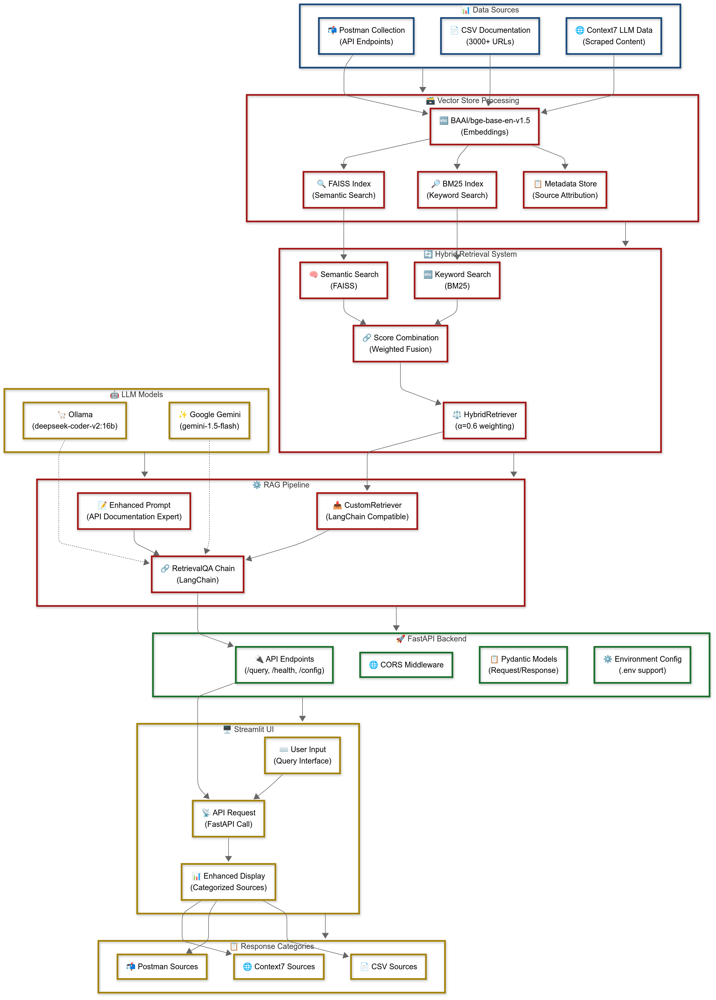

# Encompass RAG Assistant
[](https://opensource.org/licenses/MIT)

A sophisticated Retrieval-Augmented Generation (RAG) system for querying Encompass API documentation with natural language, featuring hybrid retrieval and multiple LLM support.

## Table of Contents
- [Overview](#overview)
- [Features](#features)
- [Architecture](#architecture)
- [Installation](#installation)
- [Usage](#usage)
- [Configuration](#configuration)

## Overview

The Encompass RAG Assistant is an advanced tool that allows users to query Encompass API documentation using natural language. It leverages a hybrid retrieval system combining semantic and keyword search across 3000+ Encompass URLs, Postman collections, and Context7 documentation to provide accurate, contextual answers to API-related questions.

This application combines cutting-edge RAG techniques with a user-friendly interface to make Encompass API documentation more accessible and easier to navigate.

## Features

- **Hybrid Retrieval System**: Combines FAISS semantic search with BM25 keyword search for superior accuracy
- **Multi-LLM Support**: Choose between Ollama (qwen2.5-coder:7b) and Google Gemini models
- **Advanced Embeddings**: Uses BAAI/bge-base-en-v1.5 for superior semantic understanding
- **Categorized Sources**: Responses include categorized sources (Context7, Postman, CSV documentation)
- **Multiple Data Sources**: Integrates Context7 LLM data, Postman collections, and CSV documentation
- **Environment Configuration**: Full .env support for easy deployment and configuration
- **Enhanced FastAPI Backend**: Robust API with health checks, configuration endpoints, and CORS support
- **Streamlit UI**: Clean, intuitive interface with enhanced source display
- **Source Attribution**: Detailed source tracking with metadata and full content access

## Architecture

The system features a sophisticated multi-component architecture:

###  **Data Processing & Storage**
- **BAAI/bge-base-en-v1.5 Embeddings**: State-of-the-art semantic embeddings
- **FAISS Vector Store**: High-performance semantic similarity search
- **BM25 Index**: Traditional keyword-based search for exact matches
- **Metadata Store**: Comprehensive source attribution and tracking

### **Hybrid Retrieval System**
- **HybridRetriever**: Intelligent combination of semantic and keyword search
- **Weighted Fusion**: Configurable alpha parameter (default 0.6) for search balance
- **Score Normalization**: Advanced scoring system for optimal result ranking

### **LLM Integration**
- **Ollama Support**: Local LLM hosting with qwen2.5-coder:7b
- **Google Gemini**: Cloud-based gemini-1.5-flash model option
- **LangChain Integration**: Standardized LLM interface with RetrievalQA chains

### **API & Interface**
- **FastAPI Backend**: Production-ready API with comprehensive endpoints
- **Environment Configuration**: Full .env support for deployment flexibility
- **Streamlit UI**: Enhanced interface with categorized source display
- **CORS Support**: Ready for web application integration



## Installation

### Prerequisites
- Python 3.11+ (Python 3.13 compatible)
- Ollama (for local LLM hosting) OR Google Gemini API key
- CUDA-compatible GPU recommended for embeddings
- 16GB+ RAM recommended for optimal performance
- Optional: [uv](https://docs.astral.sh/uv/) for faster package installation

### Setup

1. Clone the repository:
   ```bash
   git clone https://github.com/richie-rk/encompass-rag-assistant.git
   cd encompass-rag-assistant
   ```

2. Create a virtual environment:
   ```bash
   python -m venv venv
   source venv/bin/activate  # On Windows: venv\Scripts\activate
   ```

3. **Install dependencies** — pick the path that matches your hardware. The
   only thing that differs is which `torch` build gets installed; the
   application code dispatches to CPU or GPU at runtime via `JINA_DEVICE`
   in `.env`.

   **Option A — uv with pyproject.toml (recommended)**

   *CPU only* (works everywhere; embedding pipeline runs on CPU):
   ```bash
   uv pip install -e .
   ```

   *NVIDIA GPU (CUDA 12.1)* — pulls CUDA-enabled `torch` + `faiss-gpu`:
   ```bash
   uv pip install -e ".[gpu]"
   ```

   *With dev extras*:
   ```bash
   uv pip install -e ".[dev]"
   uv pip install -e ".[dev,gpu]"   # GPU + dev tools
   ```

   *Everything*:
   ```bash
   uv pip install -e ".[all]"
   ```

   **Option B — plain pip (no uv)**

   *CPU*:
   ```bash
   pip install -e .
   # or:  pip install -r requirements.txt
   ```

   *NVIDIA GPU (CUDA 12.1)* — pip can't auto-route `torch` to the PyTorch
   index from `pyproject.toml`, so the GPU build is a two-step:
   ```bash
   pip install -e .
   pip uninstall -y torch
   pip install torch --index-url https://download.pytorch.org/whl/cu121
   pip install faiss-gpu>=1.7.4
   ```

   > **💡 Which method to choose?**
   > - **uv (Option A)**: significantly faster installs; auto-routes `torch`
   >   to the right index when you pick `[gpu]`. Recommended.
   > - **pip (Option B)**: works without extra tooling; needs the manual
   >   torch swap above for GPU.
   >
   > **💡 Hardware setup**
   > After install, set `JINA_DEVICE=cuda` (or `mps` on Apple silicon) in
   > `.env` to actually use the GPU at embedding time. Default is `cpu`.

4. **LLM Setup** (Choose one):

   **Option A: Ollama (Local)**
   ```bash
   # Install Ollama from https://ollama.ai/
   ollama pull qwen2.5-coder:7b
   ```

   **Option B: Google Gemini (Cloud)**
   ```bash
   # Get API key from https://ai.google.dev/
   # Set in .env file: GEMINI_API_KEY=your_key_here
   ```

5. **Environment Configuration**:
   ```bash
   # Create .env file with your settings
   cp .env.example .env
   # Edit .env with your preferred configuration
   ```

6. **Crawl the Developer Connect documentation**:
   ```bash
   # From the repo root — fetches all guide / API-reference / changelog pages
   # for /developer-connect/ and writes scripts/data/developer_connect.jsonl
   python -m scripts.crawler
   ```

   The crawler enumerates the page frontier from the ReadMe sidebar (no BFS) and
   extracts each page's authored Markdown, OpenAPI spec, and metadata directly
   from the embedded `ssr-props` JSON. First run takes ~5–7 minutes (216 pages
   at 0.5 s delay); HTML is cached to `scripts/data/cache/`, so re-runs are
   instant.

   Useful flags:
   ```bash
   python -m scripts.crawler --dry-run              # enumerate frontier, no fetches
   python -m scripts.crawler --limit 10             # debug: only first 10 pages
   python -m scripts.crawler --no-cache             # ignore cache, refetch all
   python -m scripts.crawler --include-hidden       # include hidden:true pages
   python -m scripts.crawler --delay 1.0            # slower pace for politeness
   python -m scripts.crawler --help                 # full option list
   ```

   Outputs:
   - `scripts/data/developer_connect.jsonl` — one record per page (slug, title,
     URL, breadcrumb, `body_md`, OpenAPI `oas`, `updated_at`, …)
   - `scripts/data/developer_connect_manifest.jsonl` — per-URL fetch log with
     status, cache-hit, body hash, and any error reason

7. **Create the vector store**:
   ```bash
   python scripts/create_vector_store.py
   ```

## Usage

### **Quick Start**

1. **Start the FastAPI backend**:
   ```bash
   cd rag_docs/src
   python -m rag_docs.rag_app
   ```

2. **In a separate terminal, start the Streamlit UI**:
   ```bash
   cd rag_docs/src
   streamlit run rag_docs/web_ui.py
   ```

3. **Access the application**:
   - **Streamlit UI**: http://localhost:8501
   - **FastAPI docs**: http://localhost:8000/docs
   - **Health check**: http://localhost:8000/api/health

### **API Endpoints**

- `POST /api/query` - Submit questions about Encompass API
- `GET /api/health` - Check system status
- `GET /api/config` - View current configuration

## Configuration

The application is fully configurable through environment variables or a `.env` file:

### **Environment Variables**

```bash
# LLM Configuration
OLLAMA_MODEL=qwen2.5-coder:7b
USE_GEMINI=false
GEMINI_API_KEY=your_gemini_api_key_here
TEMPERATURE=0.1

# Vector Store Configuration
VECTOR_STORE_PATH=vector_store

# Embeddings (Jina v3)
JINA_BACKEND=local              # `local` (sentence-transformers) or `api`
JINA_API_KEY=                   # required when JINA_BACKEND=api
JINA_MODEL=jinaai/jina-embeddings-v3
JINA_DEVICE=cpu                 # `cpu`, `cuda`, or `mps`

# API Configuration
HOST=0.0.0.0
PORT=8000

# Logging Configuration
LOG_LEVEL=INFO
LOG_FORMAT=%(asctime)s - %(levelname)s - [%(filename)s:%(lineno)d] - %(message)s
LOG_FILE=logs/app.log
LOG_MAX_SIZE=10485760
LOG_BACKUP_COUNT=5

# Retrieval Configuration
HYBRID_ALPHA=0.6  # Weight for semantic vs keyword search
RETRIEVAL_K=5     # Number of documents to retrieve
```

### **Example .env File**

```env
# Choose your LLM provider
USE_GEMINI=false
OLLAMA_MODEL=qwen2.5-coder:7b
# GEMINI_API_KEY=your_key_here

# Vector store settings
VECTOR_STORE_PATH=vector_store
TEMPERATURE=0.1

# API settings
HOST=0.0.0.0
PORT=8000

# Logging
LOG_LEVEL=INFO
```

## Building the Package

```bash
# Build wheel and source distribution
python -m build

# Or with uv (faster)
uv build
```
---

Built with ❤️ for Encompass API users
